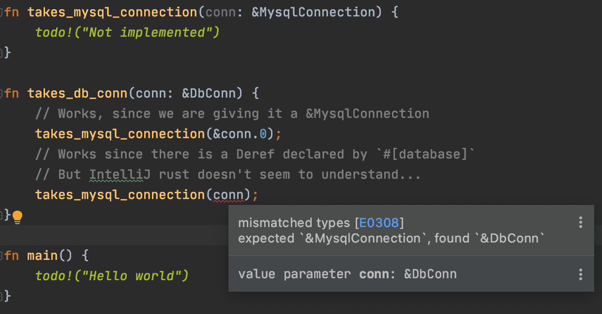

# POC - IntelliJ Rust: Macro Declared Deref not identified correctly

The statement

```rust
#[database("poc")]
pub struct DbConn(diesel::MysqlConnection);
```

Which uses the `database` macro from `rocket_contrib`
generates the following code:

```rust
impl ::std::ops::Deref for DbConn {
    type Target = diesel::MysqlConnection;
    #[inline(always)]
    fn deref(&self) -> &Self::Target {
        &self.0
    }
}
impl ::std::ops::DerefMut for DbConn {
    #[inline(always)]
    fn deref_mut(&mut self) -> &mut Self::Target {
        &mut self.0
    }
}
```

But it doesn't seem to get picked up by Intellij Rust v0.3.126.3220-201.

As seen here:



But `cargo build` works just fine, as does any program that uses this construct.

## Database setup for running locally

Start a MySQL database using docker:

```
docker run \
    -d \
    --name poc-deref-mysql \
    --publish 3306:3306 \
    -e MYSQL_ROOT_PASSWORD=changeme \
    -e MYSQL_DATABASE=poc \
    -e MYSQL_USER=poc \
    -e MYSQL_PASSWORD=abcd1234 \
    mysql:5.7 \
    --character-set-server=utf8mb4 \
    --collation-server=utf8mb4_unicode_ci
```

Then `diesel migration run` or `diesel migration redo`.
